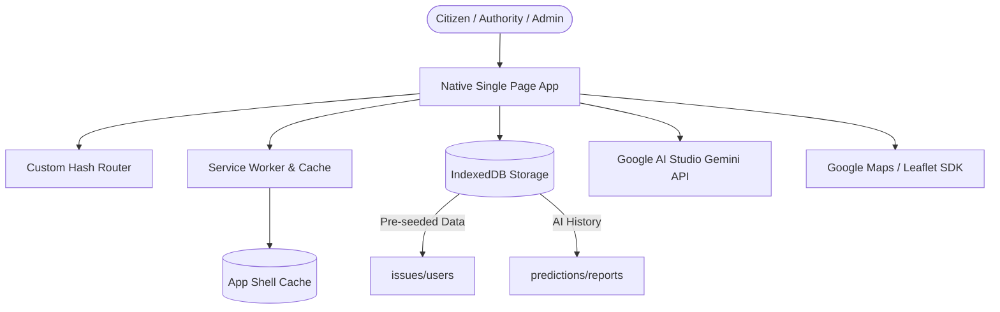
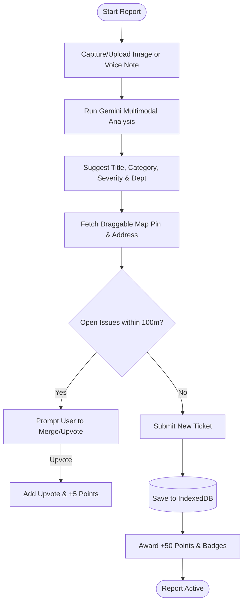
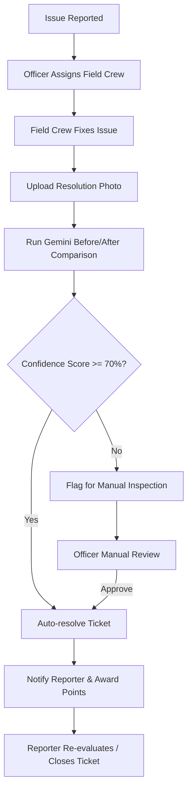

# 📍 CivicFix AI

[](assets/civicfix_logo_banner.png)

**CivicFix AI** is an AI-powered Progressive Web App that transforms how communities identify, report, validate, track, and resolve civic infrastructure issues.

> **Live Demo:** [https://civic-fix-ten.vercel.app](https://civic-fix-ten.vercel.app) By combining Google's Gemini Vision, Gemma 4, and Google Maps with an Antigravity backend deployed on Google Cloud Run, CivicFix creates a transparent, gamified, and intelligent bridge between citizens and government authorities.

The platform operates across three user roles — Citizens, Government Authorities, and Admins — with each role experiencing a purpose-built interface that makes civic participation effortless and resolution accountable.

By leveraging **Google AI Studio (Gemini 1.5 Flash models)** for image classification, voice transcription, and fix validation, alongside a **unified Google Maps/Leaflet Map fallback engine**, CivicFix AI turns reporting potholes, streetlights, garbage, and leaks into a seamless, gamified community effort.

---

## 🌟 Unique Features

### 1. Multimodal AI Copilot (Gemini Integration)
CivicFix AI uses advanced multimodal AI prompts to parse and classify reports automatically:
- **Vision Classification:** Automatically analyzes uploaded media to recommend the issue category (e.g., pothole, streetlight, garbage, flooding), severity level (1 to 5), and the responsible municipal department.
- **Voice Transcription:** Transcribes citizen voice recordings (up to 60 seconds) directly into written descriptions using Google Gemini Audio APIs.
- **Before/After Fix Validation:** When a field crew uploads a picture of a resolved issue, the AI compares the original and the new photo. If the resolution confidence score exceeds 70%, the ticket is automatically resolved.

### 2. Proactive Duplicate Prevention
- To prevent cluttering, the app uses browser geolocation to scan for open reports within a **100-meter radius** that match the same category.
- Citizens are prompted to **upvote and merge** their report into the existing issue instead of creating duplicates, receiving a **+5 upvote point boost** while keeping city databases clean.

### 3. Unified Map & Failover Engine
- Full integration with **Google Maps SDK** for real-time pin dragging and address lookup.
- If Google Maps fails to load (due to API key limits or credential errors), the application automatically falls back to **Leaflet** with CartoDB Voyager tiles.
- **Dynamic Dark Mode Map styling:** Map layers automatically switch to dark mode maps (CartoDB Dark Matter) matching the system settings.

### 4. Interactive Gamification System
- Automatic points triggers: Reporting (+50), Upvotes (+5), Comments (+10), Resolutions (+100), and Weekly Streaks (+200).
- Automatic Badge Awards: *First Reporter*, *Watchdog* (10 reports), *Verified Voice* (3 resolved), *Streak Master*, and *Top Contributor*.
- A public leaderboard showing "This Month" vs "All Time" contributor rankings.

### 5. Role-Based Dashboards
- **Citizen:** View feeds, submit reports with live camera feeds, comment, upvote, track custom stats, and inspect their profile badges.
- **Authority (Officer Rajesh Kumar):** Accesses operational control panels, manages dispatch assignments, reviews AI resolution comparisons, and compiles monthly PDF reports.
- **Admin:** Special dashboard for creating/managing officer accounts, toggling issue categories, and auditing open tickets.

### 6. Offline-First PWA Capabilities
- Serves an interactive `offline.html` page when offline.
- Custom service worker (`sw.js`) caches styling, routing pages, and SVGs to ensure the app loads instantly under any network condition.

---

## 📱 Application Mockup

Here is a preview of the CivicFix AI citizen dashboard showing active reports, leaderboard status, and reporting tools:

[](assets/civicfix_dashboard_mockup.png)

---

## 👩‍💻 Contributors

- **Jhanvi Goel**
- **Diksha Pawar**
- **Deveshi**

---

## 📊 System Architecture & Workflows

### 1. High-Level Architecture
The diagram below details the interaction between the Frontend Single-Page App (SPA), the service worker cache, IndexedDB for offline data persistence, and external APIs (Google AI Studio and Maps SDK).




---

### 2. Issue Reporting Workflow (with AI Classification)
This flowchart shows the process when a citizen reports a civic issue:



---

### 3. Resolution & Verification Workflow (with Before/After AI comparison)
The municipal officer dispatch and automated validation workflow:



---

## 🛠️ Local Development & Setup

### Prerequisites

- [Node.js](https://nodejs.org) v18+ installed
- A modern browser (Chrome, Edge, Firefox, Safari)

---

### Step 1 — Clone & enter the project

```bash
git clone https://github.com/YOUR_USERNAME/CivicFix-AI.git
cd CivicFix-AI
```

### Step 2 — Install dependencies

```bash
npm install
```

> There are no runtime dependencies — `http-server` is pulled via `npx` on first run.

### Step 3 — Set up environment variables

The app needs two API keys to enable Google Maps and Google AI features.  
Create the local env file (this file is in `.gitignore` and will **never** be committed):

```bash
cp env.example.js env.js
```

Open `env.js` in your editor and replace the placeholder values:

```js
window.__CIVICFIX_ENV__ = {
  GOOGLE_AI_STUDIO_KEY: 'AIzaSy...your-gemini-key-here',  // Google AI Studio (Gemini)
  GOOGLE_MAPS_KEY: 'AIzaSy...your-maps-key-here'          // Google Maps JavaScript API
};
```

#### Where to get the keys

| Key | Where to get it | APIs to enable |
|---|---|---|
| `GOOGLE_AI_STUDIO_KEY` | https://aistudio.google.com/app/apikey | Gemini API |
| `GOOGLE_MAPS_KEY` | https://console.cloud.google.com/apis/credentials | Maps JavaScript API, (optional) Geocoding API |

> **No keys? No problem.** The app works fully in **simulation mode** without real keys:
> - Maps fall back to Leaflet (OpenStreetMap tiles)
> - AI classification uses smart mock data
> - All features remain usable for testing

### Step 4 — Start the dev server

```bash
npm run dev
```

The app will be served at **http://localhost:8080**.

---

### Pre-seeded Test Accounts

The database seeds automatically on first load. Use these accounts to log in:

| Role | Email | Password |
|---|---|---|
| **Citizen** | `citizen@civicfix.gov` | `citizen123` |
| **Authority** | `officer@civicfix.gov` | `officer123` |
| **Admin** | `admin@civicfix.gov` | `admin123` |

---

### Docker Deployment (optional)

```bash
docker build -t civicfix-ai .
docker run -p 8080:8080 civicfix-ai
```

> When using Docker, copy `env.example.js` to `env.js` inside the container **before building**, or mount it as a volume at runtime.

---

### Deploy to Vercel

The project includes a `vercel.json` and a build script that generates `env.js` from Vercel Environment Variables.

1. Push the repo to GitHub.
2. In the **Vercel Dashboard**, import the repo.
3. Vercel detects the project as static. The `vercel-build` script in `package.json` runs automatically.
4. **Set environment variables** in Vercel (Settings → Environment Variables):

   | Name | Value |
   |---|---|
   | `GOOGLE_AI_STUDIO_KEY` | `AIzaSy...` your Gemini API key |
   | `GOOGLE_MAPS_KEY` | `AIzaSy...` your Google Maps key |

5. Deploy. The build script generates `env.js` with your keys. The app works with live AI and Google Maps on Vercel.

> Can't set env vars? The app still works in simulation mode on Vercel — just without live AI and Google Maps (falls back to Leaflet).

---

### If you get a "Secrets detected" email from GitHub

If a past commit exposed an API key in `index.html`:

1. **Rotate the key** — Go to [Google Cloud Credentials](https://console.cloud.google.com/apis/credentials) → API Keys → click the exposed key → "Regenerate Key". The old key is instantly revoked.
2. **The current code is already fixed** — Keys now live in `env.js` (gitignored) and are never hardcoded in tracked files.
3. **Dismiss the alert** — On GitHub, go to the Security tab → Secret scanning alerts → dismiss if you've rotated the key.

---

### GitHub Publishing Checklist

Before pushing to a public repo, make sure:

1. ✅ `git status` — `env.js` should **not** appear (it's in `.gitignore`)
2. ✅ `env.example.js` is committed — it's the template others will copy
3. ✅ No API keys remain in `index.html` or `js/config.js` (they were removed in the env refactor)
4. ✅ Run `npm run dev` and verify the app loads at http://localhost:8080
